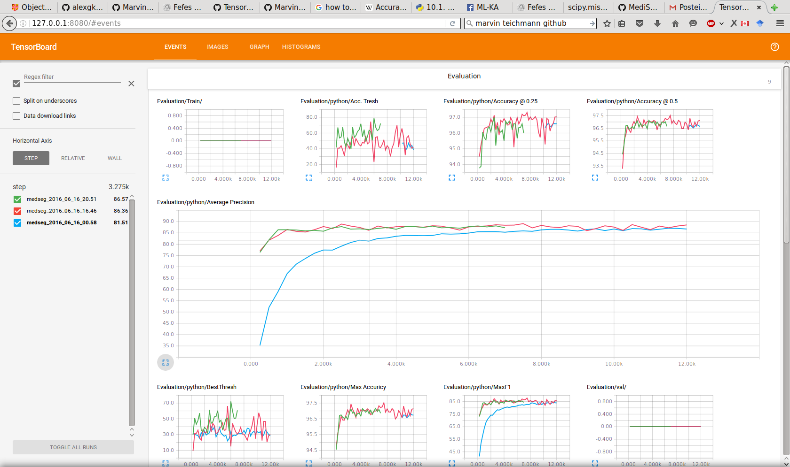
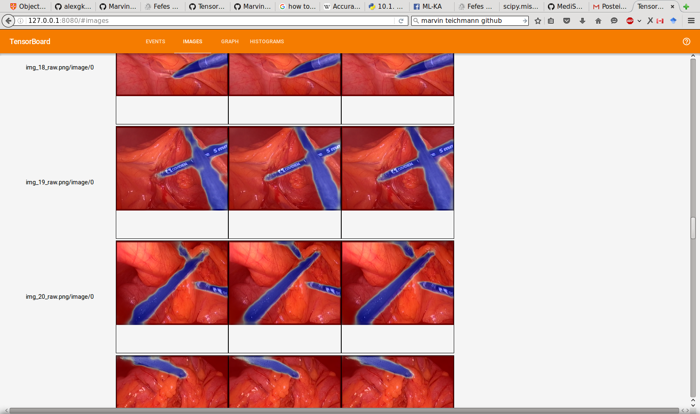

The models are trained on OP2-4 and evaluated on OP1.

## Setup and Usage

To train the model, move `data/val.txt` and `data/train.txt` to the folder which contains the data (i.e. contains `Segmentation_Rigid_Training\`. And configure TensorVision or `hypes` to point to this dir. Then run:

```bash
$ python train.py
```

Results can be evaluated in `Tensorboard` or written to disk using `tv-analysis`. 


## Results

| Model | Name | Hypes  | Max F1 | Average Precision | BestThresh   | Accuracy @ max | Thresh max. Acc.  | Accuracy @ 0.5 | Accuracy @ 0.25 | 
| ----- | ---------- | ---------------------|--------|---------| ------| ----------- | -----------  | -----------| ------------|
| 1     | FCN32_VGG  |  LR: 1e-6            | 83.86% |  86.72% | 0.28  | 96.73 %     | 0.38         |  96.65%    | 96.59 %     |
| 2     | FCN32_VGG  |  LR: 1e-5            | 85.90% |  88.51% | 0.32  | 97.13 %     | 0.42         |  97.11%    | 97.01 %     |
| 3     | FCN32_VGG  |  LR: 1e-5   head: 2  |        |         |       |             |              |            |             |

## Evaluation in `tv-analysis`

The output of `tv-analysis` on `Model 2` can be found in `Results`. `tv-analysis` estimates the metrics of the final weights and writes out the overlay of the validation images. 

 

## Evaluation in Tensorboard

During training results of the evaluation are continuously written to Tensorboard. Tensorboards creates plots which visualize the convergence.



Additionally the latest images outputs of each model are written to tensorboard, allowing visual side-by-side comparision.




